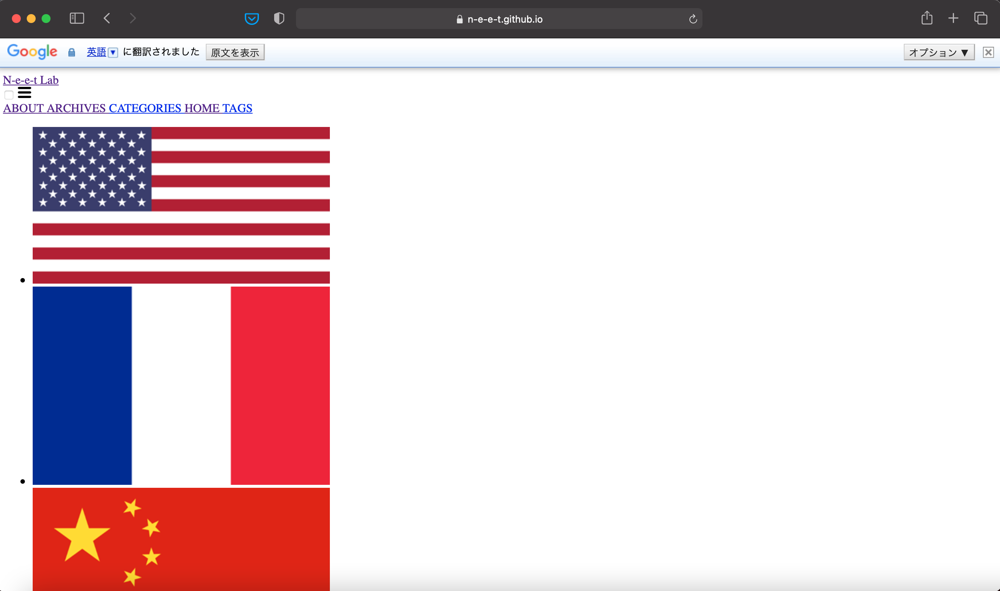

とにかくうまくいかない。。。
良さげなテーマを見つけてフォークして来るところまでしか上手くいってないんじゃないか？？

最初はmasterブランチをSourceに設定して、っぽい感じに表示はできてた。
けどサンプルのページを見てみた感じ、LateXの記述？が上手く表示されてなかった。

どうにかしたいなーと思い調べたら、「ローカルでビルドしたらいける」的なものを見つけて早速試してみた。

が、ダメ。できません。

そこで、フォーク元のREADMEを読んでたら

```
GitHub Pages without limitation

GitHub Pages runs in safe mode and only allows a set of whitelisted plugins/themes. In other words, the third-party gems will not work normally.

To use the third-party gem in GitHub Pages without limitation:

Here is a GitHub Action named jekyll-deploy-action for Jekyll site deployment conveniently. 👍
```
とのことで、GitHub Actionってやつを使ってgh-pagesブランチを公開してねーってことらしいので書かれてるとおりにいじくりまわす。。

とか色々やってたらそもそものレイアウトも反映されなくなって困った。
Issueにも同じようにレイアウトが反映されない人がいて質問してたけど、回答の通りにurl直してもできんかったね



結局masterの方を公開してます